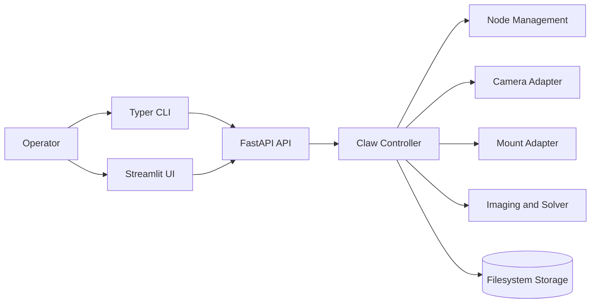
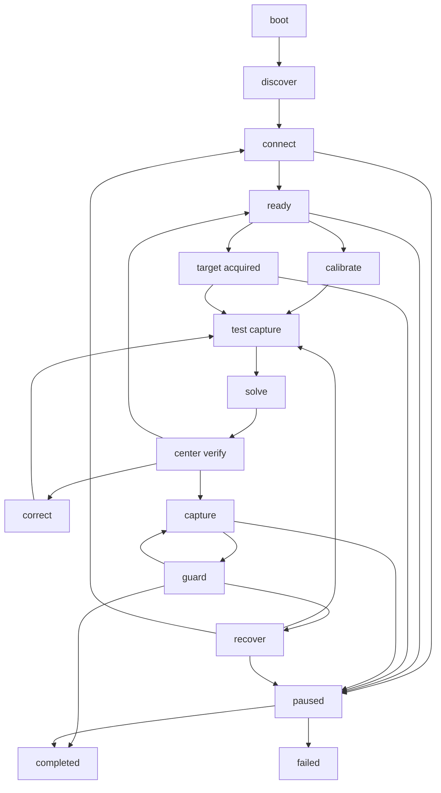

# Architecture

Kepler Node starts from one concrete deployment target and grows outward from stable capability boundaries.

## System View

## Current Posture

- Optimize first for Raspberry Pi 5 + iEXOS-100-02 PMC-Eight + Fuji X-T5
- Keep package boundaries generic so concrete adapters can be swapped later
- Prefer Python for orchestration, control flow, and data handling

## Client Model

Kepler is intended to run as the node-side control plane.

Remote planners such as KStars/Ekos can supply target intent and operator workflow around the node, but Kepler still owns local verification, correction, capture control, and recovery.

The Pi should stay a field-ready node first, not a desktop astronomy workstation by default.

## Domain Layout

- `kepler_node.agent`: orchestration and state-machine logic
- `kepler_node.camera`: camera adapters and exposure workflows
- `kepler_node.mount`: mount control and sync flows
- `kepler_node.imaging`: quality checks, solving, and image analysis
- `kepler_node.storage`: telemetry, artifacts, and session persistence

## Session Loop

## Current Readiness Posture

Kepler is no longer just a control-core prototype. The current repo already contains the main controller, local API, Streamlit operator surfaces, equipment-profile flow, target staging, session start, and the bootstrap or upgrade scripts needed for the supported node profiles.

The remaining v1 work is mostly proof and hardening rather than missing major surfaces: GPS-backed trusted time and location still need real node validation, and both supported planner modes still need repeated end-to-end verification on a bootstrapped Raspberry Pi install.